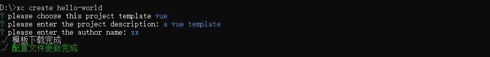

## xxgcs-fs-cli介绍

xxgcs-fs-cli是一个基于Vue.js进行快速开发的完整系统，通过xxgcs-fs-cli实现的交互式项目脚手架。

xxgcs-fs-cli，可以主要解决以下问题：

 * 减少重复性工作

 * 规范项目开发目录结构

 * 统一团队开发风格，便于跨团队合作，及后期维护，降低新人上手成功

 * 提供一键前端项目的创建、配置、本地开发、插件扩展等功能，让开发者更多时间专注于业务

## 安装

可以使用下列命令安装脚手架的包：

```javascript

  npm install -g xxgcs-fs-cli

```

## 创建一个项目

运行以下命令来创建一个新项目：

```javascript

  xc create hello-world
  
``` 

提供默认的设置，可快速创建一个新项目的原型。

  

## 使用命令

  


 